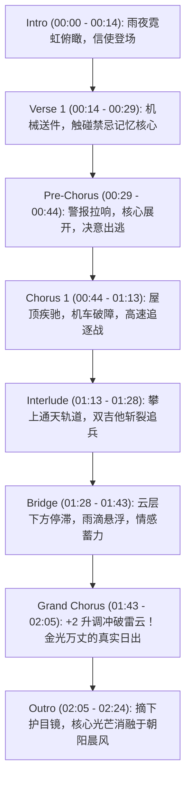

# 🎬 《NEON PULSE（霓虹脉冲）》叙事型音乐影像（PV）分镜导演脚本

> **曲名**：《NEON PULSE（霓虹脉冲）v2》  
> **演唱**：重音テト（Kasane Teto）  
> **时长**：02:24.000（78 小节 @ 130.0 BPM）  
> **PV 类型**：赛博朋克公路奔袭 · 觉醒与救赎叙事型动画 MV（Story-driven Cinematic Animated PV）  
> **视觉基调**：新雨夜景霓虹（Cyan / Magenta / Deep Navy） $\longrightarrow$ 破云终极金光黎明（Golden Sunrise / Amber Bloom）

---

## 🌌 一、 世界观与角色设定 (Worldbuilding & Characters)

### 1. 世界观设定：【第 07 观测区 · 霓虹沉降都市（Sector 07: Under-Neon）】
* **下层都市（00:00 ~ 01:43）**：一座永不放晴的立体垂直赛博都市。巨型全息广告牌在酸雨中折射出刺眼的蓝紫光芒，底层市民的记忆与情感被量化为“脉冲数据条（Pulse Shards）”在黑市流通；
* **上层苍穹（01:43 ~ 02:24）**：穿透厚重工业雨云层之上的平流层，那里保留着人类早已遗忘的真实初升朝阳。

### 2. 核心角色：【重音テト（Teto）—— 脉冲信使（Pulse Runner #0401）】
* **外设形象**：
  * 半透明磨砂黑机能风连帽雨衣（内置发光回路缝线）；
  * 标志性的红双螺旋钻头双马尾，末端带有光纤脉冲跳动效果；
  * 左眼佩戴全息战术单目镜（用于读取城市脉冲路径），右眼为带有机械光圈的赤红义眼；
* **故事动机**：作为一名麻木穿梭在雨夜中的记忆信使，她在一次运送中意外读取了一枚被禁止销毁的远古核心——里面记录着“纯净真实的晨光与二人约定”。她决定违抗母体安保指令，带着这颗核心冲破城市穹顶！

---

## 📽️ 二、 全曲镜头分镜与时码导演总谱 (Shot-by-Shot Storyboard)

---

### 【第一幕：沉沦的霓虹之海】

#### 01. 前奏（Intro）| 00:00.000 ~ 00:14.769 (Bars 1 - 8)
* **BGM 状态**：Vital 赛博脉冲琶音独自响起 $\to$ 滤波低频 Reese 贝斯沉入 $\to$ 4-on-the-floor 地鼓重踏进点。
* **分镜画面**：
  * **[00:00 - 00:07] 远景（Extreme Long Shot）**：俯瞰庞大的赛博都市全景。倾盆暴雨，巨幅全息霓虹广告在水雾中摇曳，暗色调的蓝绿（Cyan）光污染弥漫；
  * **[00:07 - 00:14] 中景 $\to$ 特写（Medium to Close-up）**：镜头快速俯冲拉近至摩天大楼边缘。雨滴砸在机能雨衣兜帽上，重音 Teto 抱膝坐在天台边缘，赤红色的双马尾在雨夜冷风中微微发光。镜头摇向她手中的微光发光核心（Data Core）。
* **动效卡点**：第 8 小节底鼓 4 连击，Teto 单目镜亮起红光警示（BOOTING SEQUENCE READY）。

---

#### 02. 主歌（Verse 1）| 00:14.769 ~ 00:29.538 (Bars 9 - 16)
* **歌词**：
  * `00:14.769` 夜の街 光るネオンの海（夜晚的街道 闪烁着霓虹的海洋）
  * `00:18.462` 風を切り裂いて 走る（撕裂长风 肆意奔跑）
  * `00:22.154` 僕らの鼓動が 鳴り響く（我们的心跳 轰鸣回响）
  * `00:25.846` 明日を照らしてゆくよ（照亮崭新的明天）
* **分镜画面**：
  * **[00:14 - 00:18] 侧面跟拍（Tracking Shot）**：Teto 戴上单目镜，踩上反重力悬浮机车，穿梭在狭窄幽暗的下层霓虹小巷中，路面积水溅起光斑；
  * **[00:18 - 00:22] 慢动作特写**：车把上的显示屏突然滋滋作响，那枚核心自动解密，投射出一道虚幻的青涩人形残影（记忆中的伙伴/旧日约定）；
  * **[00:22 - 00:29] 主观视点（POV）**：Teto 的单目镜中数据流疯狂刷屏，心率曲线伴随地鼓跳动，原本麻木的机械眼瞳孔骤然放大，被这抹未经篡改的温暖光影所震撼。

---

### 【第二幕：引信点燃与破壁追逐】

#### 03. 预备段（Pre-Chorus）| 00:29.538 ~ 00:44.308 (Bars 17 - 24)
* **歌词**：
  * `00:29.538` 遠く消えそうな 夢を抱きしめて（紧紧拥抱 那看似遥远将逝的梦想）
  * `00:33.231` 今 飛び出す未来へ（此刻 跃向辽阔的未来）
  * `00:36.923` 振り向かずにゆけ この夜を越えて（不再回头 跨越这片漫漫长夜）
  * `00:40.615` 今 光放て（此刻 绽放耀眼光芒）
* **分镜画面**：
  * **[00:29 - 00:36] 逆光全景**：城市防卫系统的探照灯瞬间打在 Teto 身上！刺耳的警报光圈在夜空爆开，数台重型机械无人机从阴影中俯冲而出；
  * **[00:36 - 00:40] 动作特写**：Teto 毫不迟疑，一把将核心拍入机车动力炉（Overdrive Core Inserted）！仪表盘转速表瞬间爆表，车尾喷射出耀眼的桃红（Magenta）脉冲光尾；
  * **[00:40 - 00:44] 极致大特写（Extreme Close-up）**：`今 光放て` 唱响瞬间，Teto 嘴角扬起无畏的笑容，机车油门拧到底，飞跃断裂的高架天桥！

---

#### 04. 第一副歌（Chorus 1）| 00:44.308 ~ 01:13.846 (Bars 25 - 40)
* **BGM 状态**：Vital 16-Voice SuperSaw 巨浪铺开，强力 4-on-the-floor 推背爆发！
* **歌词**：
  * `00:44.308` ネオンパルスのなかで 踊る僕らの声よ 響いてゆけ
  * `00:51.692` この手伸ばして 掴む未来だけを見つめて走る
  * `00:59.077` 限界を越えてゆけ 今すぐ輝く明日へと 止まらない
  * `01:06.462` 思いだけで 響け声よ つないで行け 未来へつなげ
* **分镜画面**：
  * **[00:44 - 00:51] 广角旋转镜头（Orbital Dynamic Shot）**：机车在摩天大楼的垂直玻璃幕墙上高速飞驰！背景是巨大的赛博都市深渊与闪电雨夜；
  * **[00:51 - 00:59] 战斗动作剪辑（Fast Cutting）**：Teto 侧身甩尾避开无人机的锁定激光，反手投掷脉冲电磁镖，无人机在身后连环炸开绚烂的火花雨；
  * **[00:59 - 01:06] 情感虚实交错**：残影伙伴的虚幻手臂与 Teto 握在车把上的机械手重叠在一起，金色光流顺着手臂注入机车；
  * **[01:06 - 01:13] 仰视大景深**：机车冲上通向天穹顶端的重力轨道缆绳，笔直向漆黑无际的云层顶端逆流而上！

---

### 【第三幕：风暴中的坚定与升华】

#### 05. 间奏（Interlude）| 01:13.846 ~ 01:28.615 (Bars 41 - 48)
* **BGM 状态**：Vital 赛博主音 Lead SOLO 华丽鸣响，双轨吉他与切音相辉呼应。
* **分镜画面**：
  * **[01:13 - 01:20] 纯视觉高能打击**：轨道缆绳上的高速激战！Teto 拔出脉冲光刃，伴随吉他 SOLO 的每一个升降音阶，精准切断追击者的机械抓钩；
  * **[01:20 - 01:28] 升空过渡**：周围的摩天大楼逐渐变小，暴风雨越来越剧烈，机车穿入电闪雷鸣的黑云漩涡之中。

---

#### 06. 过门（Bridge）| 01:28.615 ~ 01:43.385 (Bars 49 - 56)
* **BGM 状态**：半速鼓组，低通滤波下潜，空灵梦幻的梦境感。
* **歌词**：
  * `01:28.615` 朝の光包む この手握りしめて 走り出す未来
  * `01:36.000` 君とならば どこまでも行けると信じている
  * `01:41.538` 光を突き
* **分镜画面**：
  * **[01:28 - 01:36] 极慢镜头（Super Slow-Motion）**：机车引擎在雷云内部出现过载熄火，整台车在半空中失重悬浮。雨滴定格在空气中，倒映着 Teto 略显疲惫却坚毅的脸庞；
  * **[01:36 - 01:41] 核心呼应**：核心的光芒温暖地笼罩了整个驾驶舱，虚幻的伙伴微笑着对她轻声说出“相信你”；
  * **[01:41 - 01:43] 瞬间吸气与点火**：`光を突き` 音符落下的瞬间，Teto 双手重新紧握车把，机车所有回路爆发出前所未有的纯金色等离子光焰！

---

### 【第四幕：破云见日与永恒消融】

#### 07. 终极副歌（Grand Modulated Chorus）| 01:43.385 ~ 02:05.538 (Bars 57 - 68)
* **BGM 状态**：**+2 升调炸裂（C#m / E 大调）**！全曲能量最高峰！
* **歌词**：
  * `01:43.385` ネオンパルスのなかで 踊る僕らの声よ 響いてゆけ
  * `01:50.769` この手伸ばして 掴む未来だけを見つめて走る
  * `01:58.154` この手のばして 掴む未来へ！
  * `02:01.846` 二度と迷わず 限界を超えて行けーーー！（C#6 绝唱冲顶托底）
* **分镜画面**：
  * **[01:43 - 01:50] 破云奇迹（The Breakthrough Moment）**：机车如同离弦之箭，瞬间刺破厚重压抑了百年的黑色雷云层！
  * **[01:50 - 01:58] 视觉大反转（Visual Shift）**：画面从阴冷压抑的蓝黑雨夜，瞬间被**万丈纯净耀眼的金色朝阳与浩瀚如海的白云（Cloud Sea）**彻底填满！整个声场与视界豁然开朗！
  * **[01:58 - 02:05] 高空飞行全景**：Teto 在云海之上迎着初升的巨大太阳飞跃，金色光芒洒满她赤红色的双马尾与雨衣。`限界を超えて行けーーー` 的长音中，她向着太阳张开双臂，彻底挣脱了地面的束缚！

---

#### 08. 尾奏消融（Outro & Dissolve）| 02:05.538 ~ 02:24.000 (Bars 69 - 78)
* **BGM 状态**：歌姬空灵 Ad-lib（`Ah~`） $\to$ 鼓组脱落，留白 Vital Pluck $\to$ 滤波下沉至 350Hz 渐弱淡出。
* **歌词**：`02:05.538` Ah〜 (Neon Pulse...)
* **分镜画面**：
  * **[02:05 - 02:12] 中景特写**：机车在平静的云海上方平稳滑翔。Teto 缓缓抬手摘下了头上的单目战术镜，露出了完整的清澈面容；
  * **[02:12 - 02:18] 核心消融（Dissolve into Dawn）**：车把上的核心完成使命，化作漫天金色的粒子与晨风融为一体，随风飘向天际；
  * **[02:18 - 02:24] 远景淡出（Fade Out into Light）**：Teto 迎着晨光微微一笑，深吸一口真实的空气。镜头缓缓拉远，机车化作云海地平线上的一抹微光，伴随音乐最后的泛音，画面在温润的白金光晕中缓缓淡出黑屏。
  * **尾声字幕**：`NEON PULSE - Music & Story Complete`。

---

## 🎨 三、 动效与文字排版设计（Motion & Typography for PV Agent）

1. **歌词排版美学**：
   * **下层雨夜（00:00 - 01:43）**：使用无衬线纤细机能风字体（如 *DIN Pro* / *Teko* / *Source Han Sans Heavy*），文字带有轻微的色散（Chromatic Aberration）与毛刺霓虹扫光；
   * **破云黎明（01:43 - 02:24）**：字体切换为优雅纯净的衬线/书法大字（如 *A1 Mincho* / *筑紫明朝*），纯白加金边粒子扩散；
2. **节奏卡点与粒子系统（VFX Sync）**：
   * 严格调用 [`lyrics_timeline.json`](file:///F:/antigravity%20lol/antigravity-p/projects/project_neon_pulse/export/lyrics_timeline.json) 中的 `characters` 毫秒级时间戳，实现每个重音和假名的**打字机扫光（Karaoke Sweep）与弹跳震动（Kinetic Pop）**；
   * 第 68 小节后随着鼓组剥离，画面粒子速度降低 70%，形成如丝般顺滑的慢动作落幕。
